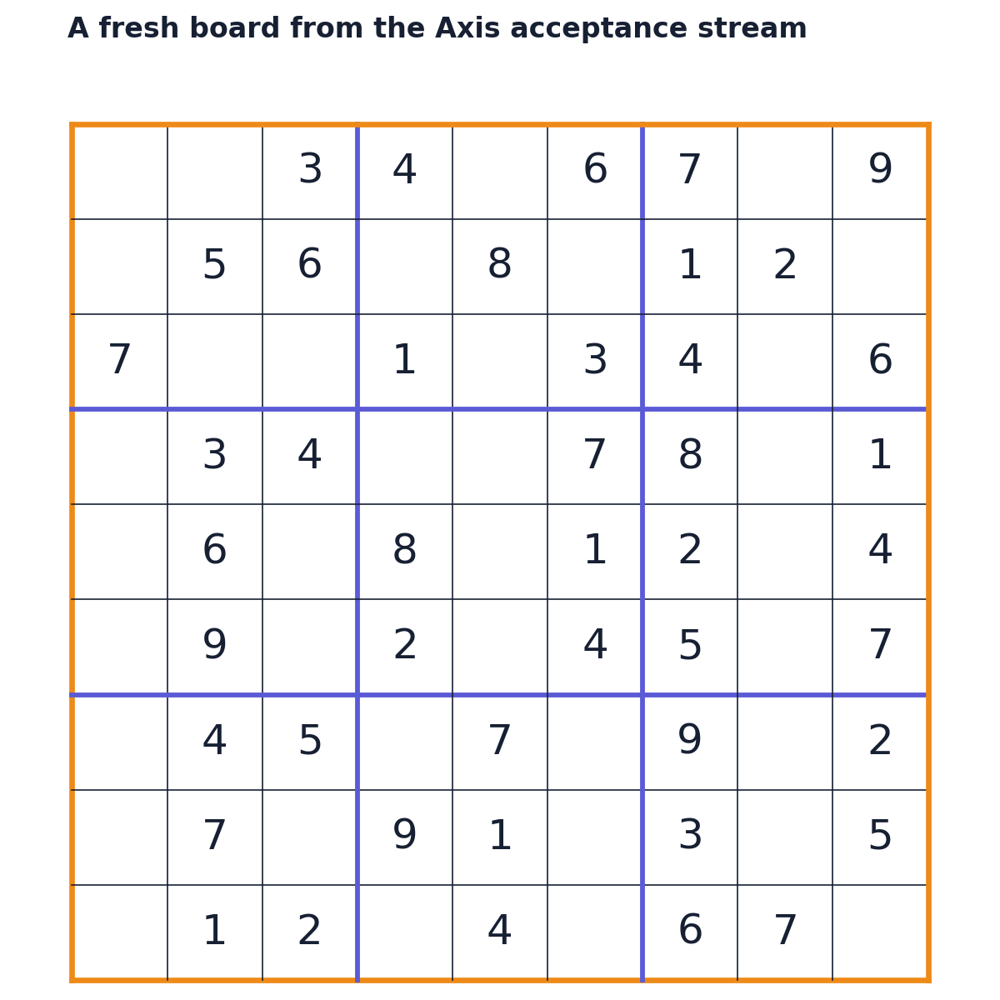
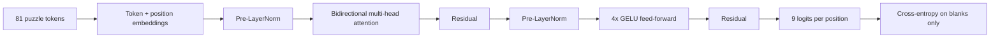
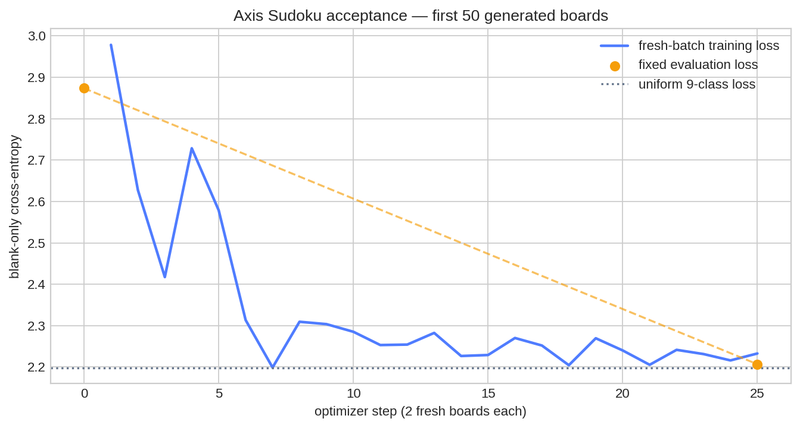

# Sudoku Transformer

[](https://www.rust-lang.org/)
[](https://github.com/furkanhaney/axis)
[](https://developer.nvidia.com/cuda-toolkit)
[](LICENSE)



A bidirectional transformer that learns to fill Sudoku blanks, written in Rust
on [Axis](https://github.com/furkanhaney/axis).

Sudoku is small enough to understand completely and rich enough to test a real
model stack. Every prediction must respect row, column, and box constraints;
the useful answer depends on the whole board; and exact puzzle solves expose
mistakes that per-cell accuracy can hide.

The project began as a Python + PyTorch experiment in 2025. The 2026 version
replaces that implementation entirely:

```text
Python + PyTorch  →  Rust + Axis
fixed Kaggle file →  generated stream of valid boards
implicit epochs   →  executable data-regime assertions
```

## Current experiment

The model keeps the original GPT-2-style structure without causal masking:



The training source creates a valid completed grid, permutes digits, bands,
rows, stacks, and columns, then rejection-samples a fresh clue mask until an
exact bounded solver proves the puzzle has one solution. It never needs to wrap
around a dataset. The program canonicalizes each clue board under digit
relabeling, then Axis compares that supplied identity across training, tuning,
and final audit data.

Axis checks those claims while the model runs:

```text
samples consumed:      50
unique sample IDs:     50
observed reuse:                  0.0000%
canonical cross-population overlap: 0
```

The current bounded RTX 5090 run used a 3,129-parameter model, 500 updates, and
128,000 fresh boards. On its fixed 512-board tuning population, blank-only loss
fell from `2.8133` to `2.1376` and blank accuracy rose from `11.73%` to `17.19%`.
An untouched 1,024-board audit measured `2.1377` loss and `17.36%` blank
accuracy. No puzzle was solved completely. The full command finished in
`20m 16.94s`, with zero observed training-ID reuse and zero overlap among
training, tuning, and audit identities. This is a learning result on uniquely
solvable generated puzzles, not a Sudoku-solving result.



## Historical result

The original PyTorch study trained 25M, 40M, and 80M models for 100,000 updates
on a fixed one-million-puzzle corpus. Its largest run reported **99.95% cell
accuracy** and **98.92% completely solved validation puzzles**. Those are useful
reference numbers, not results from the new Axis implementation.

The current research question is whether a continuously generated stream changes
the scaling picture when memorizing a finite puzzle file is removed from the
experiment.

## Run it

Requirements:

- Linux with an NVIDIA GPU supported by cuTile
- Rust 1.89 or newer
- `libclang`
- CUDA 13.2

Install a repository-local CUDA toolkit when needed:

```bash
python3 scripts/setup_cuda.py
```

The installer materializes CUDA's six runtime, cuRAND, and NVVM linker names
as regular-file copies. Rerunning it also repairs missing or stale copies, so
the local toolkit remains usable where repository policy forbids symlinks.

Then run the complete bounded acceptance:

```bash
bash scripts/check.sh
```

Or choose the experiment directly:

```bash
# Three updates, two fresh boards per update
bash scripts/train.sh --smoke

# Local research baseline
bash scripts/train.sh \
  --steps 100 \
  --batch 4 \
  --eval-size 256 \
  --eval-batch 4 \
  --eval-every 25 \
  --audit-size 512 \
  --log-every 10 \
  --embedding 24 \
  --heads 4 \
  --layers 2 \
  --blanks 36 \
  --learning-rate 1e-3 \
  --weight-decay 1e-2
```

Add `--bf16` to round matrix-product inputs to BF16 while retaining FP32
accumulation, parameters, reductions, gradients, and AdamW state. The selected
precision is printed in the run receipt.

Every run reports:

- blank-only cross-entropy;
- accuracy over cells that were blank in the input;
- exact whole-puzzle solve rate;
- observed sample identities and reuse;
- versioned semantic identity counts for training, tuning, and audit data; and
- wall-clock time and parameter count.

Large evaluation populations execute in bounded `--eval-batch` chunks and are
aggregated into one metric. This keeps the scientific sample size independent
of the current backend's per-operation contraction-plan limit.
`--audit-size` adds a separately seeded population that is evaluated only after
training, so a configuration selected from tuning curves still receives an
untouched final test.

## Project structure

```text
sudoku-transformer/
├── src/
│   ├── main.rs              generated data, training, metrics, receipts
│   └── model.rs             embeddings and bidirectional Transformer
├── docs/
│   └── migration.md         preserved contract and current differences
├── models/
│   ├── axis_tiny_00/        first Rust + Axis run
│   └── gpt2_*/              historical PyTorch metrics
├── img/                     boards and measured learning curves
├── scripts/
│   ├── setup_cuda.py        verified local CUDA 13.2 install
│   ├── cargo.sh             reproducible Cargo/CUDA launcher
│   ├── train.sh             training entry point
│   ├── render_readme.py     reproducible measured README figures
│   └── check.sh             format, lint, tests, GPU smoke
├── Cargo.toml               Axis pinned by exact Git revision
└── Cargo.lock
```

The generator is tested independently: every row, column, and 3×3 box contains
1–9 exactly once; every puzzle has the declared number of blanks and exactly one
solution; and every clue matches that solution. The migration contract and
remaining claim boundaries are in [docs/migration.md](docs/migration.md).

## Why Axis?

A tensor shaped `[batch, 81, 9]` is easy to flatten incorrectly. Axis gives
`batch`, `position`, and `digit` distinct identities, so the model says which
axis attention contracts, which axis softmax normalizes, and which axis
cross-entropy classifies.

The same principle applies above the tensor level. `masked_mean` refuses a
nonbinary or empty blank mask. `assert_idr()` refuses a repeated sample identity.
The disjointness guard refuses a canonical puzzle identity that crosses the
training, tuning, or final-audit boundaries, even when the raw generator IDs
differ. The goal is an experiment that fails loudly when it stops being the
experiment described here.
