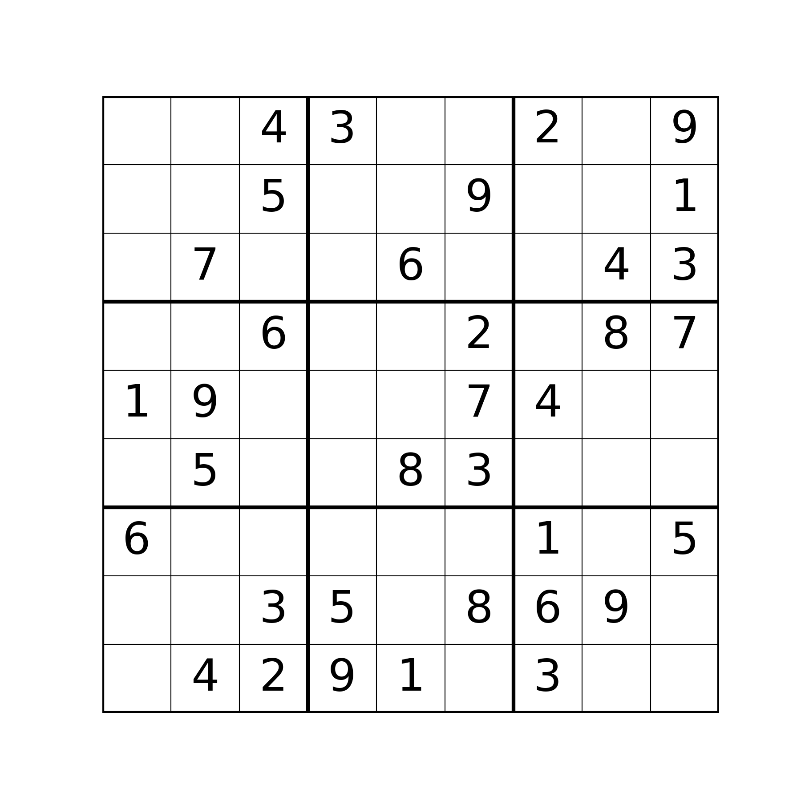
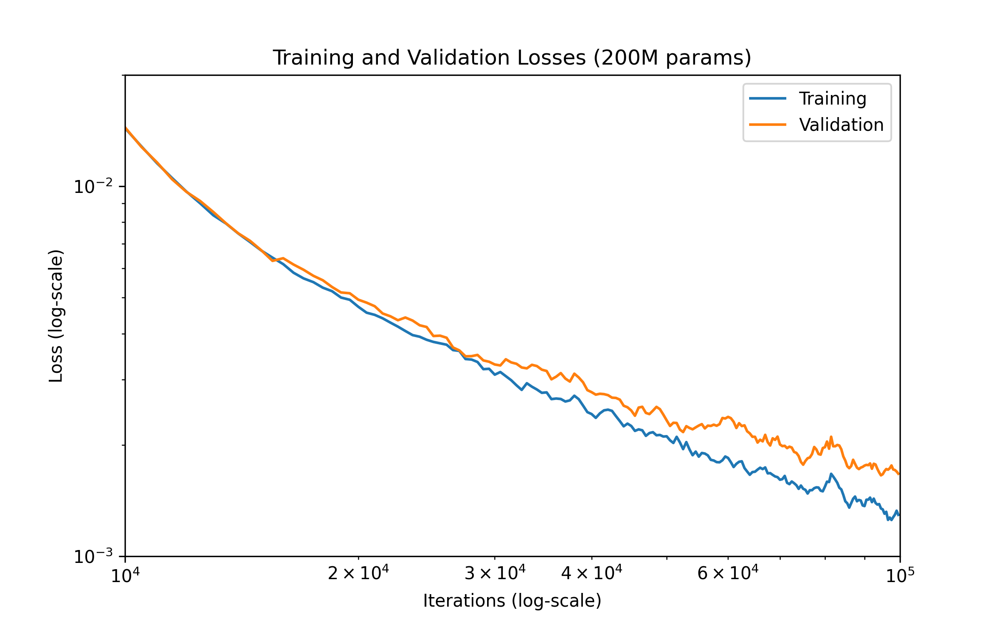
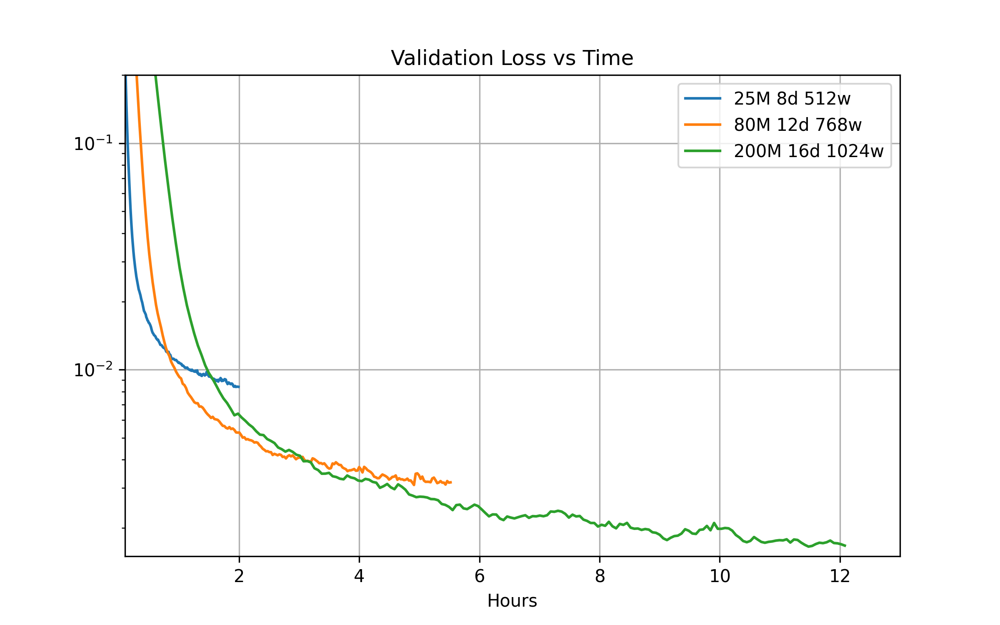
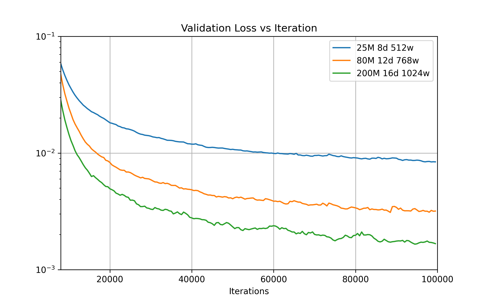
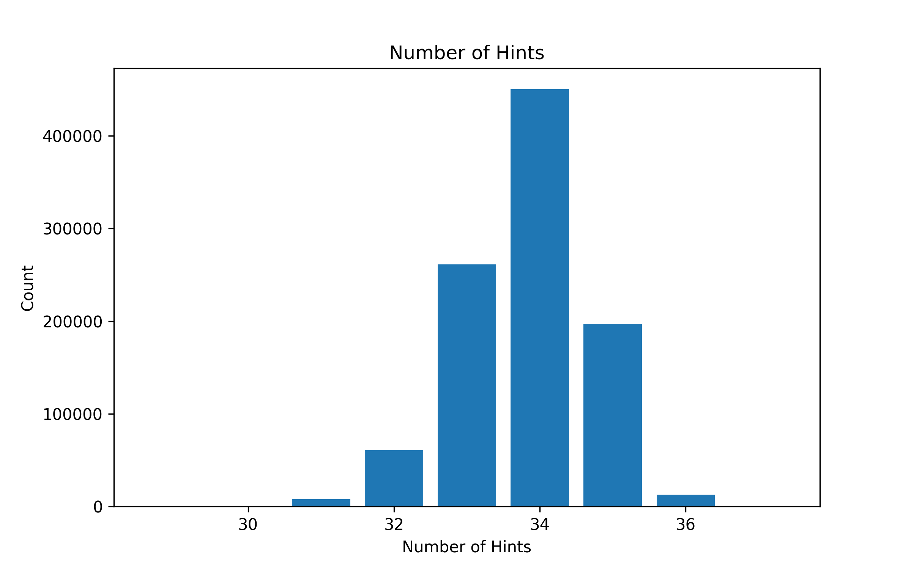
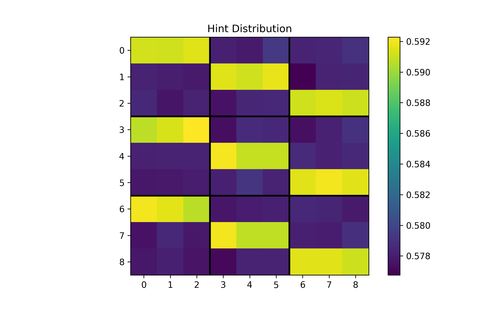

# Sudoku Transformer Project




A PyTorch implementation of a GPT-2 style non-causal transformer for solving Sudoku puzzles. The model reaches 99.95% accuracy and solves 98.92% of puzzles completely correctly in the validation set.

> **Note:** While backtracking algorithms can solve Sudoku puzzles extremely fast (microseconds), this project serves as an important case study in ML research for understanding the strengths and limitations of transformer architectures. It provides insights into how transformers learn constraint satisfaction problems, their sample efficiency across different model scales, and emergent capabilities in structured reasoning tasks.

## Results

Models of 3 different sizes are trained:
- **Small (25M)**: 6 layers, 384 embedding, 6 heads
- **Medium (40M)**: 8 layers, 512 embedding, 8 heads
- **Large (80M)**: 12 layers, 768 embedding, 12 heads

Each was trained for 100,000 iterations with a batch size of 256 on a RTX 3090 GPU, with the longest run taking about 12 hours. We reach a maximum accuracy of 99.95% solving 98.92% of puzzles completely with the largest model. We can see scaling laws in action in the graphs.

**Training Cost:** All three experiments were run on a rented RTX 3090 machine via [Vast.ai](https://vast.ai) at $0.210/hour for approximately 20 hours total, costing around $4.20 for the complete set of experiments.



We can see some overfitting on the largest model despite our relabeling augmentation.



The medium model surpasses the small model in about 1 hour while the large model surpasses the medium model in about 3 hours on a 3090 GPU.



Bigger models learn faster on a per-sample basis, demonstrating higher sample efficiency.

## Dataset

The dataset is the "1 million Sudoku games" from Kaggle: https://www.kaggle.com/datasets/bryanpark. The data is split into training and validation sets with 10,000 validation examples. The data is processed from csv into npz format with np.uint8 data type.

- **Training set**: 990,000 puzzles
- **Validation set**: 10,000 puzzles
- **Format**: 81 **np.uint8** digits (0-9) where 0 represents empty cells





## Model Architecture

- **Type**: GPT-2 style transformer without causal masking (bidirectional attention)
- **Input**: Token embeddings (vocab size 10 for digits 0-9) + positional embeddings (81 positions)
- **Output**: Per-position classification into 9 classes (digits 1-9)
- **Loss**: CrossEntropyLoss computed only on non-hint positions (configurable via `mask_hints`)

### Data Augmentation

- **Relabeling**: Random permutation of digits 1-9 during training
  - Example: All 1s → 5s, all 2s → 7s, etc.
  - Preserves Sudoku structure while increasing data diversity

## Project Structure

```
sudoku/
├── config/
│   ├── gpt2_sm.json           # Small model configuration (25M params)
│   ├── gpt2_md.json           # Medium model configuration (40M params)
│   ├── gpt2_lg.json           # Large model configuration (80M params)
│   └── gpt2_xl.json           # Extra-large model configuration
├── data/
│   ├── sudoku.csv             # Raw dataset (1M puzzles)
│   └── sudoku.npz             # Processed data (train/valid splits)
├── img/                       # Training result visualizations
├── models/
│   └── {experiment_name}/     # Experiment outputs
│       ├── config.json        # Copied config
│       ├── metrics.csv        # Training metrics
│       └── best_model.pt      # Best checkpoint by validation loss
├── notebooks/
│   ├── analyze.ipynb          # Results analysis and visualization
│   └── explore.ipynb          # Dataset exploration
├── src/
│   ├── data.py                # Dataset and dataloader implementation
│   ├── gpt.py                 # GPT model architecture
│   ├── main.py                # Training script
│   ├── process.py             # Data preprocessing
│   ├── training.py            # Training loop and metrics
│   └── utils.py               # Config classes and utilities
├── LICENSE                    # MIT License
├── pyproject.toml             # Python project configuration
└── README.md
```

## Setup

1. Install dependencies using `uv`:
```bash
uv sync
```

2. Download the dataset from Kaggle and place `sudoku.csv` in the `data/` directory.

3. Process the dataset:
```bash
uv run python src/process.py
```

This will create `data/sudoku.npz` with train/validation splits.

## Training

Start training with the default configuration:
```bash
uv run python src/main.py
```

Or specify a custom config:
```bash
uv run python src/main.py --config config/my_config.json
```

### Configuration

Example configuration (`config/gpt2_sm.json`):
```json
{
  "experiment_name": "gpt2_sm_00",
  "max_iters": 100000,
  "batch_size": 256,
  "num_workers": 4,
  "learning_rate": 1e-4,
  "eval_interval": 500,
  "n_embd": 384,
  "n_layer": 6,
  "n_head": 6,
  "dropout": 0,
  "mask_hints": true,
  "use_compile": true,
  "compile_mode": "reduce-overhead"
}
```

**Configuration Parameters:**
- `experiment_name`: Name of the experiment (used for output directory)
- `max_iters`: Maximum training iterations
- `batch_size`: Batch size for training and validation
- `num_workers`: Number of data loader workers
- `learning_rate`: Learning rate for AdamW optimizer
- `eval_interval`: Evaluate on validation set every N iterations
- `mask_hints`: If `true`, only compute loss on non-hint positions (where input == 0). If `false`, compute loss on all 81 positions (default: `false`)
- `n_embd`: Embedding dimension
- `n_layer`: Number of transformer layers
- `n_head`: Number of attention heads
- `dropout`: Dropout probability
- `use_compile`: Enable PyTorch 2.0+ compilation for faster training (default: `true`)
- `compile_mode`: Compilation mode - "default", "reduce-overhead", or "max-autotune" (default: `"reduce-overhead"`)

### Metrics

The training loop tracks:
- **loss**: CrossEntropyLoss computed on all 81 positions (when `mask_hints=false`) or only on non-hint positions (when `mask_hints=true`)
- **acc**: Accuracy on non-hint positions only (where input == 0)
- **acc_full**: Per-puzzle accuracy (1.0 if all 81 positions correct, 0.0 otherwise)

Both training and validation metrics are saved to `models/{experiment_name}/metrics.csv`.

## Model Checkpointing

- Best model (by validation loss) is saved to `models/{experiment_name}/best_model.pt`
- Checkpoint includes:
  - Model state dict
  - Optimizer state dict
  - Iteration number
  - Validation loss

## Implementation Details

### Input/Output Format
- **Input**: `(batch_size, 81)` integers 0-9
- **Output**: `(batch_size, 81, 9)` logits for classes 0-8 (representing digits 1-9)
- **Targets**: Solution digits 1-9 converted to class labels 0-8

### Key Features
- Bidirectional attention (no causal masking)
- Relabeling augmentation for training data
- Optional hint masking: compute loss only on non-hint positions via `mask_hints` config
- Exponential moving average (EMA) for training metrics
- Arithmetic mean for validation metrics
- Automatic experiment directory management
- Best model checkpointing

## Dependencies

- Python >= 3.13
- PyTorch >= 2.5.0
- NumPy >= 2.0.0
- Pandas >= 2.2.0
- tqdm >= 4.66.0
- torchmetrics >= 1.5.0
- pydantic >= 2.0.0
- ipykernel >= 7.1.0 (for notebooks)
- matplotlib >= 3.10.7 (for visualization)

All dependencies are managed via `uv` and specified in [pyproject.toml](pyproject.toml).

## Notebooks

The project includes Jupyter notebooks for analysis and exploration:
- [notebooks/analyze.ipynb](notebooks/analyze.ipynb) - Training results analysis and visualization
- [notebooks/explore.ipynb](notebooks/explore.ipynb) - Dataset exploration and statistics

## License

This project is licensed under the MIT License - see the [LICENSE](LICENSE) file for details.
